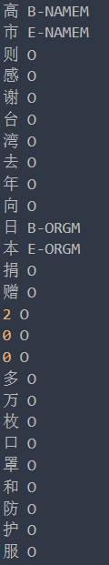
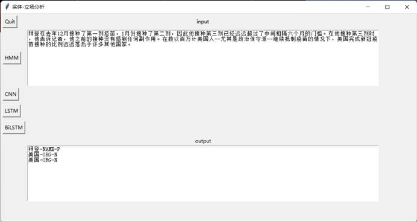

### covid-vaccine-comment

#### **实验数据**

一些国家或者组织实体以及部分人物对于新冠疫苗的态度，数据的格式如下，它的每一行由一个字及其对应的标注组成，标注集采用BME，B表示实体开头，M表示实体中间，E表示实体结尾，，后面加上实体类型和态度（P（支持）N（反对）M（中立））句子之间用一个空行隔开。该数据集就位于目录下的ResumeNER文件夹里。如下为数据及标签示例：

#### **最终效果**

对于新冠疫苗相关话题可以进行实体边缘识别、实体类型识别以及实体对于新冠疫苗话题立场分析

具体展示如下图，可以自行选择已经训练好的模型

